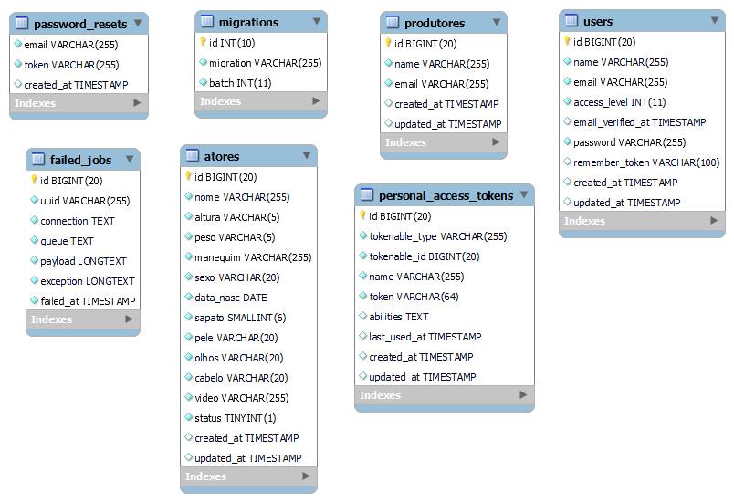

# Agência de atores
Sistema para cadastrar atores, cadastrar produtores, adicionar assistentes e enviar dados dos atores aos produtores. O sistema possui 2 tipos de usuários, administrador e assistente.

Demonstração do projeto online: [Clique aqui](https://app-webteste.herokuapp.com/)

## Páginas e funções
### Página Inicial (admin e assistente)
A página inicial contém um filtro para encontrar atores e exibe um grid com o resultado.
- O formulário para filtrar atores possui os mesmos campos usados ​​para cadastrar o ator.
- O grid contém imagem e dados dos atores com opções para selecionar e enviar para produtores.

### Cadastro de atores (admin e assistente)
Página com formulário para cadastro de atores com os seguintes campos:
- Nome (Obrigatório)
- Manequim (Obrigatório, arquivo)
- Altura (Obrigatório)
- Peso (Obrigatório)
- Sapato (Obrigatório, númerico)
- Sexo (Obrigatório)
- Data de nascimento (Obrigatório, data)
- Pele (Obrigatório)
- Olhos (Obrigatório)
- Cabelo (Obrigatório)
- LInk de video (Obrigatório)

### Cadastro de produtor (admin)
Página com formulário para cadastro de produtor com os campos:
- Nome (Obrigatório)
- E-mail (Obrigatório, único)

A página também contém uma tabela com todos os produtores com opção para editar e remover.

### Adicionar assistente (admin)
Página com formulário para o admin adicionar assistente com os campos:
- Nome (Obrigatório)
- E-mail (Obrigatório, único)
- Senha (Obrigatório, mínimo 8 caracteres)
- Confirmação da senha (Obrigatório)

A página também contém uma tabela com todos os assistentes com opção para remover.

### Modificar Senha (admin e assistente)
Página com formulário para modificar senha. Os seguintes campos são obrigatórios:
- Senha atual
- Nova senha
- Repetir nova senha

### Funções a serem adicionadas
- Editar dados de ator
- Remover ator
- Ativar e desativar ator

## Frameworks
<!-- - Laravel v8
- Vue.js v2
- Bootstrap v5.1 -->

### Laravel v8
#### Dependências
- [Laravel pt-BR localization](https://github.com/lucascudo/laravel-pt-BR-localization)
#### Comandos utilizados
```
$ php artisan ui vue --auth
$ npm install && npm run dev
$ composer require lucascudo/laravel-pt-br-localization --dev
```

### Vue.js v2
#### Dependências
- [Laravel Vue Pagination](https://www.npmjs.com/package/laravel-vue-pagination)
- [SweetAlert](https://www.npmjs.com/package/sweetalert)
- [Vue input mask](https://www.npmjs.com/package/v-mask)
- [Vue Loading Overlay](https://www.npmjs.com/package/vue-loading-overlay)
- [VueMeta](https://www.npmjs.com/package/vue-meta)
- [VueRouter](https://www.npmjs.com/package/vue-router)
#### Comandos utilizados
```
$ npm install laravel-vue-pagination
$ npm install sweetalert
$ npm install v-mask
$ npm install vue-loading-overlay@^3.4.2
$ npm install vue-meta
$ npm install vue-router
```
### Bootstrap v5.1
Foi utilizado link CDN 

## Rotas Laravel CRUD
```
// Modificar senha do usuário logado
PUT|PATCH /modificar-senha

// Assistentes
GET /assistentes
POST /assistente
DELETE /assistente/{user}

// Produtores
POST /produtores/enviar-email
GET /produtores
POST /produtores
PUT|PATCH /produtores/{produtor}
DELETE /produtores/{produtor}

// Atores
GET /atores
POST /atores
```

## Banco de dados


## Instalação
**Instale as dependências**
```
$ composer install --no-scripts
```
**Copie o arquivo .env.example**
```
$ copy .env.example .env
```
**Crie uma nova chave para a aplicação** 
```
$ php artisan key:generate
```
**Configure o banco de dados (utilizei o MySQL) no arquivo .env e rodar os migrations com:**
```
$ php artisan migrate
// ou com os seeders, populando o banco de dados
$ php artisan migrate --seed
```
**Iniciando a aplicação**
```
$ php artisan serve
```

## Desenvolvedor
- **Edivandro Lima:** https://github.com/EdivandroLima
- **Linkedin:** https://www.linkedin.com/in/edivandro-lima/
